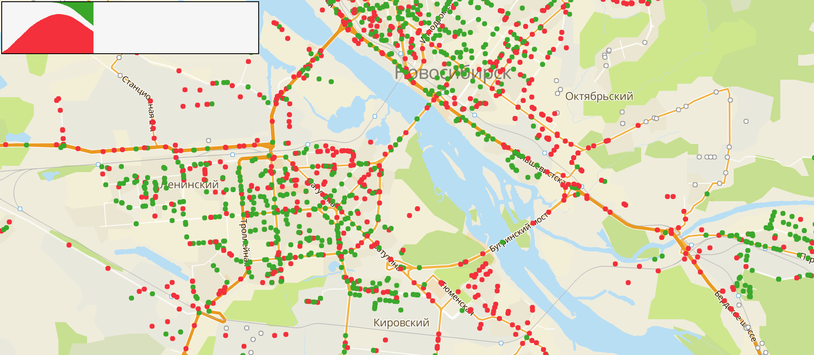

# Covid Simulation

Simulation of people moving throughout the city to demonstrate Covid-19 spreading visually on the map. The goal is to show that staying at home is the best option.



[See a demo](https://trufi.github.io/covid-simulation/)

## Setup

You must set the data URL for the simulation. You can get the data from the `assets` folder.

An example of simulation setting with 2GIS MapGL API:

```ts
import { Simulation } from '@webmaps/covid-simulation';

const map = new mapgl.Map('KEY', {
    center: [82.93024, 55.01605],
    zoom: 12,
    key: 'YOUR_2GIS_API_KEY',
});

const icons = {
    virgin: { width: 10, height: 10, url: 'VIRGIN_ICON_URL' },
    desease: { width: 10, height: 10, url: 'DESEASE_ICON_URL' },
    immune: { width: 10, height: 10, url: 'IMMUNE_ICON_URL' },
};

// Start of the simulation
const simulation = new Simulation(map, { icons });

simulation.start({
    randomSeed: 15,
    diseaseRange: 1,
    immunityAfter: 10,
    waitAtHome: 2,
    timeOutside: 5,
    humansCount: 4000,
    humansStop: 0,
    diseaseStartCount: 50,
    humanSpeed: 100,
    humanDeviation: 0.5,
    dataUrl: './assets/nsk.json', // You must set the data URL
});

// Request for the statistics
const stats = simulation.getStat(); // Returns SimulationStat[]

// Stop the simulation and remove all points
simulation.stop();
```

where:

```ts
interface SimulationStartOptions {
    /**
     * Random is determined in the simulation. That's the first seed of it.
     */
    randomSeed: number;

    /**
     * The distance in meters of disease spreading between humans
     */
    diseaseRange: number;

    /**
     * The time in seconds when an immunity comes after the infection
     */
    immunityAfter: number;

    /**
     * The time in seconds that any human spend in his home after they has come there
     */
    waitAtHome: number;

    /**
     * The time in seconds that a human spends on the street, after which they will first try to enter a house.
     */
    timeOutside: number;

    /**
     * Relative deviation of parameters immunityAfter, waitAtHome, timeOutside.
     * Gets values from 0 to 1.
     * The final parameter for each human is calculated by the formula:
     *   parameter = parameter + (random() - 0.5) * humanDeviation * parameter
     */
    humanDeviation: number;

    /**
     * Total amount of humans
     */
    humansCount: number;

    /**
     * The number of humans who will never move, such people appear immediately in houses
     */
    humansStop: number;

    /**
     * The number of humans who are infected at the start
     */
    diseaseStartCount: number;

    /**
     * The speed of people in something-something
     */
    humanSpeed: number;

    /**
     * The URL from which the simulation data will be downloaded
     */
    dataUrl: string;
}

interface SimulationStat {
    time: number; // amount of milliseconds from the start
    disease: number; // amount of sick humans
    immune: number; // amount of humans with immunity
    virgin: number; // not those and not others
}
```
